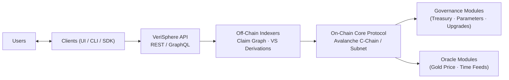

# VeriSphere Technical Architecture (Avalanche Edition)
**Version:** 2025-11 (MVP Architecture)  
**Chain:** Avalanche C-Chain / Configurable Subnet  
**Format:** GitHub-safe Markdown (all formulas fenced using $`...`$)

---

# 1. Overview

VeriSphere is implemented as a **two-layer architecture**:

## 1.1 Core Consensus Layer (On-Chain, Avalanche EVM)

Implements all **truth-staking rules**, **immutability**, and **economic logic**:

- Immutable atomic Posts (claims)
- Support/challenge staking queues
- Verity Score (VS) logic
- Yield & burn calculations
- Evidence link graph logic
- VSP token mint/burn with idle-decay
- Governance execution (parameter changes, upgrades, treasury)

Executed entirely through **Solidity contracts** on Avalanche.

## 1.2 Interface & Intelligence Layer (Off-Chain)

Provides convenience, visibility, and assistance:

- Web UI, mobile UI
- REST/GraphQL API
- Off-chain indexers (graph database)
- AI semantic search and claim decomposition
- Global CDN cache for read-heavy access

This layer **cannot** change truth-state — it only mirrors and assists.

---

# 2. Layered System Diagram

---

# 3. On-Chain Architecture (Avalanche EVM)

All contracts are implemented in **Solidity**, deployed on:

- **Avalanche C-Chain** (default), or
- **Dedicated Avalanche Subnet** (recommended for post-MVP scaling)

Avalanche provides fast finality (<1 sec), mature tooling, and EVM compatibility.

## 3.1 Contract Modules

| Module | Responsibilities |
|--------|------------------|
| **VSP Token** | ERC-20 compatible; mint/burn rights for staking engine & treasury; idle-decay |
| **PostRegistry** | Creates immutable Posts; enforces posting-fee burn; stores metadata & stake totals |
| **StakeEngine** | Manages staking queues, flips, withdrawals, positional weight logic |
| **YieldEngine** | Computes yield/burn based on VS, maturity, and position index |
| **LinkGraph** | Manages support/challenge links, prevents cycles, calculates contextual influence |
| **GovernanceHub** | Proposal lifecycle, quorum, threshold, execution of parameter and treasury actions |
| **Treasury** | Holds VSP reserves, mints rewards, pays bounties |
| **Oracle Interfaces** | Gold price oracle, time oracle, optional off-chain feeds |

---

# 4. Core Data Model

## 4.1 Post
- `postId`
- `text` (immutable assertion)
- `creator`
- `timestamp`
- `postingFeeBurn`
- `active` (Active / Superseded)
- `supportTotal`
- `challengeTotal`
- `VS` (derived, not stored)

## 4.2 StakeLot
- `postId`
- `staker`
- `amount`
- `side` (support/challenge)
- `positionIndex`
- `entryTimestamp`
- `accruedNet`
- `withdrawable`

## 4.3 Link
- `fromPost` → `toPost`
- `relationType` (support/challenge)
- `ctxStake`
- `influenceMultiplier`
- Anti-cycle guard

## 4.4 GovernanceProposal
- `proposalId`
- `proposer`
- `metadataURI`
- `votingStart`
- `votingEnd`
- `quorum`
- `threshold`
- `executed`
- `expired`
- `actionData` (encoded contract calls)

---

# 5. Protocol Flows

## 5.1 Post Creation
1. User signs: `createPost(text)`  
2. Text is atomic (enforced by UI)  
3. Gold-pegged posting fee burned  
4. Post saved with `VS = 0`  
5. Post remains neutral until stake ≥ posting fee

---

## 5.2 Staking
1. User selects Post + side  
2. `StakeEngine` inserts into support/challenge queue  
3. Position index assigned  
4. Totals recalculated → VS updated  
5. Yield/burn applied continuously

### Verity Score Formula
With $`A`$ = support and $`D`$ = challenge:

$`VS = (2 \times (A / (A + D)) - 1) \times 100`$

Clamped to $`[-100, +100]`$.

---

## 5.3 Evidence Linking

Normalize source VS:

$`nVS = (BaseVS + 100) / 200`$

Support link adds:

$`A_{support} += nVS \times R_{ctx}`$

Challenge link adds:

$`A_{challenge} += nVS \times R_{ctx}`$

Cycle detection enforces a strict DAG.

---

## 5.4 Yield & Burn Mechanics

### Maturity factor:
$`K = S / A`$  
$`f(T) = T / (T + K)`$

### Effective annual rate:
$`r_{eff} = R_{min} + (R_{max} - R_{min}) \times v \times f(T)`$

### Positional weight:
$`w_i = (1 / i) / \sum_{j=1}^{N_s} (1/j)`$

### Stake update:
$`\Delta n = n \times sgn \times w_i \times r_{eff} \times \Delta t`$

Where:
- $`sgn = +1`$ if aligned with VS  
- $`sgn = -1`$ if opposed  
- $`sgn = 0`$ if VS = 0  

---

## 5.5 Withdrawal
- Stake removed  
- Queue re-ordered  
- Final yield/burn applied  
- Tokens returned  

## 5.6 Flip Stake
- Remove from one queue  
- Insert at tail of opposite side  

---

# 6. Off-Chain Architecture

## 6.1 Indexers

Reads Avalanche logs into:

- Claim graph  
- Stake queues  
- VS histories  
- User positions  
- Link graph  
- AI embeddings  

Technologies:

- Node or Rust indexer  
- PostgreSQL / ElasticSearch  
- The Graph (recommended)  

---

## 6.2 API Gateway

REST / GraphQL endpoints for:

- `/posts/search?q=`  
- `/posts/{id}`  
- `/posts/{id}/links`  
- `/posts/{id}/stakes`  
- `/wallet/{address}/positions`  
- `/governance/proposals`  

Includes caching, filtering, and pagination.

---

## 6.3 AI Support Layer

Provides:

- Semantic duplicate detection  
- Atomicity enforcement (split multi-assertion text)  
- Evidence suggestions  
- Summary of debate dynamics  
- Graph-based truth maps  

AI **cannot** modify truth; it only assists users.

---

# 7. Execution Environment (Avalanche)

## 7.1 C-Chain Deployment (Default)
- Full EVM compatibility  
- Transaction finality < 1 second  
- Standard gas economics  
- Best tooling and highest reliability

## 7.2 Dedicated Subnet (Recommended Post-MVP)
Advantages:

- Custom gas token (optionally VSP)  
- Isolated blockspace  
- Guaranteed throughput for VeriSphere  
- Custom permissioning rules  
- Faster indexing and subgraph sync  

Subnet migration is optional and reversible.

---

# 8. Governance Architecture

Governance is executed **on Avalanche** and operationally coordinated through **GitHub** + **Google Sheets**.

## 8.1 GitHub → Governance Flow
1. **Contributor opens Issue**: a Governance Proposal Object (GPO)  
2. CI tags issue with labels (phase, status, bounty)  
3. CI writes to bounty ledger (Google Sheets)  
4. Governance multisig approves & funds bounty  
5. Contributor completes deliverables  
6. CI records payout and closes issue  
7. Changes executed on-chain when applicable  

## 8.2 Reward Curve

Each task’s reward is derived from:

$`r(n) = 100 + (100000 - 100) \times e^{-k(n-1)}`$

Where:

$`k = \ln((100000 - 100)/1) / (H - 1)`$

And:

- $`H`$ = total pre-MVP hours  
- $`r(n)`$ = reward for hour $`n`$

Early foundational work earns the most.

---

# 9. Security Model

| Threat | Mitigation |
|--------|------------|
| Spam posting | Gold-pegged post fee |
| Whale ambush | Idle-decay, positional weighting |
| Sybils | Capital-weighted incentives |
| History rewrite | Posts immutable; supersession only |
| AI hallucination | AI suggestions are off-chain only |
| Cycle injection | DAG enforcement in LinkGraph |
| Treasury abuse | GovernanceHub & multisig gating |
| Smart contract bugs | Audits, formal proofs, fuzzing |

Recommended tools:

- Foundry test suite  
- Slither static analysis  
- Surya contract graphing  
- Third-party audits  

---

# 10. Development Roadmap (Avalanche)

| Phase | Deliverables |
|-------|--------------|
| **Alpha** | VSP token, PostRegistry, StakeEngine, VS logic |
| **Beta** | GovernanceHub, Treasury, Oracles, Indexer |
| **Launch** | UI, API, AI assist, SDK, full Graph indexing |
| **Scale** | Avalanche Subnet migration, mobile clients, AI-based truth maps |

---

# 11. Summary

VeriSphere’s Avalanche architecture ensures:

- **Immutable on-chain truth adjudication**  
- **Economically enforced epistemology**  
- **Fast, reliable consensus**  
- **Permissionless UI ecosystem**  
- **Transparent governance with mathematical reward curves**  

Avalanche provides the reliability, tooling, and finality required for a **global market for truth** backed by **skin-in-the-game incentives**.

VeriSphere becomes a decentralized truth engine:  
**where correctness earns, and falsehood costs.**

---
