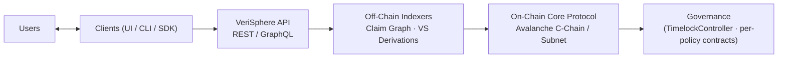

# VeriSphere Technical Architecture (Avalanche Edition)
**Version:** 2025-11 (MVP Architecture)  
**Chain:** Avalanche C-Chain / Configurable Subnet  
**Format:** GitHub-safe Markdown (all formulas fenced using $`...`$)

---

# 1. Overview

VeriSphere is implemented as a **two-layer architecture**:

## 1.1 Core Consensus Layer (On-Chain, Avalanche EVM)

Implements all **truth-staking rules**, **immutability**, and **economic logic**:

- Immutable atomic Posts (claims)
- Support/challenge staking queues
- Verity Score (VS) logic
- Yield & burn calculations
- Evidence link graph logic
- VSP token mint/burn
- Governance execution (parameter changes, upgrades, treasury)

Executed entirely through **Solidity contracts** on Avalanche.

## 1.2 Interface & Intelligence Layer (Off-Chain)

Provides convenience, visibility, and assistance:

- Web UI, mobile UI
- REST/GraphQL API
- Off-chain indexers (graph database)
- AI semantic search and claim decomposition
- Global CDN cache for read-heavy access

This layer **cannot** change truth-state — it only mirrors and assists.

---

# 2. Layered System Diagram


```mermaid
flowchart LR
    U[Users]
    U <--> C["Clients (UI / CLI / SDK)"]
    C --> API["VeriSphere API<br/>REST / GraphQL"]
    API --> IX["Off-Chain Indexers<br/>Claim Graph · VS Derivations"]
    IX --> CH["On-Chain Core Protocol<br/>Avalanche C-Chain / Subnet"]
    CH --> GOV["Governance<br/>(TimelockController · per-policy contracts)"]
```

---

# 3. On-Chain Architecture (Avalanche EVM)

All contracts are implemented in **Solidity**, deployed on:

- **Avalanche C-Chain** (default), or
- **Dedicated Avalanche Subnet** (recommended for post-MVP scaling)

Avalanche provides fast finality (<1 sec), mature tooling, and EVM compatibility.

## 3.1 Contract Modules

| Module | Responsibilities |
|--------|------------------|
| **VSPToken** | ERC-20 with ERC-2612 permit; Authority-gated mint/burn |
| **Authority** | Role registry (owner, minters, burners) |
| **PostRegistry** | Creates immutable Posts; enforces posting-fee burn; stores claim/link metadata |
| **LinkGraph** | Stores directed evidence edges; rejects self-loops and duplicate edges (cycles permitted) |
| **StakeEngine** | Consolidated lots, snapshot-based growth/decay, mint/burn settlement, positional weighting |
| **ScoreEngine** | Read-only computation of base and effective Verity Scores; cycle-safe; conservation-of-influence gate |
| **ProtocolViews** | Read-only aggregation of claim summaries, edges, and scores |
| **PostingFeePolicy** | Governance-set posting-fee amount |
| **StakeRatePolicy** | Governance-set rMin / rMax annual rate bounds |
| **ClaimActivityPolicy** | Governance-set minimum-stake threshold for post activation |
| **TimelockController** | OpenZeppelin governance timelock; gates all parameter changes and proxy upgrades |

There is no on-chain `YieldEngine`, `GovernanceHub`, `Treasury`, or oracle contract: yield/burn settlement lives inside `StakeEngine`, governance is the timelock plus the per-policy contracts above, treasury operations (relay-fee collection, market-maker reserves) are off-chain wallets coordinated by the application layer, and gold/time price feeds are consumed only by the off-chain market maker.

---

# 4. Core Data Model

## 4.1 Post
- `postId`
- `text` (immutable assertion)
- `creator`
- `timestamp`
- `postingFeeBurn`
- `active` (Active / Superseded)
- `supportTotal`
- `challengeTotal`
- `VS` (derived, not stored)

## 4.2 StakeLot
- `postId`
- `staker`
- `amount`
- `side` (support/challenge)
- `positionIndex`
- `entryTimestamp`
- `accruedNet`
- `withdrawable`

## 4.3 Link
- `fromPost` → `toPost`
- `relationType` (support/challenge)
- `ctxStake`
- `influenceMultiplier`
- Anti-cycle guard

## 4.4 GovernanceProposal
- `proposalId`
- `proposer`
- `metadataURI`
- `votingStart`
- `votingEnd`
- `quorum`
- `threshold`
- `executed`
- `expired`
- `actionData` (encoded contract calls)

---

# 5. Protocol Flows

## 5.1 Post Creation
1. User signs: `createClaim(text)` (or `createLink(from, to, isChallenge)`)  
2. Text is atomic (enforced by UI)  
3. The current `PostingFeePolicy.postingFeeVSP()` (governance-set, currently 1 VSP) is transferred from the user and burned  
4. Post saved with `VS = 0`  
5. Post remains neutral until total stake ≥ the activity threshold (`ClaimActivityPolicy.minTotalStakeVSP`, defaulting to the posting fee)

---

## 5.2 Staking
1. User selects Post + side  
2. `StakeEngine` inserts into support/challenge queue  
3. Position index assigned  
4. Totals recalculated → VS updated  
5. Yield/burn applied continuously

### Verity Score Formula

The base Verity Score is computed asymmetrically:

With $`A`$ = total support stake, $`D`$ = total challenge stake, $`T = A + D`$:

- If $`A > D`$: $`VS = +(A / T) \times RAY`$
- If $`D > A`$: $`VS = -(D / T) \times RAY`$
- If $`A = D`$ or $`T = 0`$: $`VS = 0`$

Where $`RAY = 10^{18}`$. The result is clamped to $`[-RAY, +RAY]`$,
corresponding to the range $`[-100\%, +100\%]`$.

Note: The StakeEngine uses a simpler symmetric check ($`2A - T`$)
internally for rate sign determination. Both agree on sign.

---

## 5.3 Evidence Linking

For each incoming link `(parent → target)` via link post `L`, the
contribution to the target's effective Verity Score is computed as:

```
parentMass    = parentEffectiveVS × parentTotalStake / RAY
linkShare     = linkStake / sumOutgoingLinkStake(parent)
contribution  = parentMass × linkShare × linkBaseVS / RAY
if isChallenge: contribution = -contribution
```

`parentEffectiveVS` is gated to be strictly positive (the credibility
gate); `linkBaseVS` is similarly gated. Conservation of influence is
enforced by `linkShare`: a parent's mass is split across its outgoing
links in proportion to their stake, and under bounded fan-out the
share is taken only over the top-`maxOutgoingLinks` outgoing links by
stake (with ties broken by linkPostId ascending). A link outside that
top-N contributes zero — see whitepaper §4.4.

The link graph permits cycles. The ScoreEngine handles them at read
time using stack-based detection with a depth limit of 32: a post
already on the recursion stack contributes zero for that path, and
the credibility gate further stabilises cyclic graphs. See the
whitepaper §4.2 and §4.3 for the full normative formulas and cycle
analysis.

---

## 5.4 Yield & Burn Mechanics

Stake economics are governed by the StakeEngine v3 implementation,
which uses continuous midpoint positional weighting and epoch snapshots.

The **normative specification** is in `claim-spec-evm-abi.md`,
Appendix A. Key properties:

- **Midpoint position weighting**: Each lot's `weightedPosition` is the
  midpoint of its share of the side total (`cumBefore + amount/2`).
  Per-lot rate factor is `(sideTotal − weightedPosition) / sideTotal`,
  applied independently per lot — there is no side-wide budget
  redistribution. A sole staker on a side earns half the base rate;
  the first of many earlier stakers approaches the full rate.

- **Base rate**: Computed from verity magnitude, post participation
  (total stake / sMax), and governance-controlled rate bounds (rMin,
  rMax).

- **sMax tracker**: A top-3 post tracker keeps `sMax` snapped to the
  leading post's total during normal operation. A fallback exponential
  decay (governance-configurable, currently 10% per epoch capped at
  30 epochs) only runs in the corner case where the protocol has zero
  active posts.

- **Epoch snapshots**: Growth/decay is applied discretely, at most
  once per `snapshotPeriod` (default 1 day), triggered by any
  state-changing operation or by the permissionless `updatePost(postId)`.

- **Symmetric economics**: Aligned lots grow; misaligned lots shrink.
  A lot can shrink to zero (total loss).

Refer to `claim-spec-evm-abi.md` Appendix A for the complete
formulas, symbols, and implementation notes.

---

## 5.5 Withdrawal
- A snapshot first materializes any pending epoch gains/losses  
- The user's `lot.amount` is reduced by the requested amount  
- All lots on that side have their `weightedPosition` recomputed as midpoints over the new amounts (so a partial withdraw shifts the staker — and everyone after them in the array — slightly toward the front of the queue)  
- The side total is reduced and the sMax tracker is updated  
- Tokens are transferred back to the user  
- A fully withdrawn user keeps their array slot with `amount = 0` (a "ghost lot"), removable by a governance call to `compactLots`  

## 5.6 Set Stake
The combined entrypoint `setStake(uint256 postId, int256 target)` lets
the user reach a desired stake on a post in a single transaction:

- `target == 0`: withdraw any stake on either side  
- `target > 0`: withdraw any challenge stake first, then add or reduce support to reach `|target|`  
- `target < 0`: withdraw any support stake first, then add or reduce challenge to reach `|target|`  

Switching sides therefore requires no separate "flip" function: a user
moving from `+5 VSP` to `-3 VSP` in one call has their support stake
fully withdrawn and a fresh challenge lot opened at the back of the
challenge queue.

---

# 6. Off-Chain Architecture

## 6.1 Indexers

Reads Avalanche logs into:

- Claim graph  
- Stake queues  
- VS histories  
- User positions  
- Link graph  
- AI embeddings  

Technologies:

- Node or Rust indexer  
- PostgreSQL / ElasticSearch  
- The Graph (recommended)  

---

## 6.2 API Gateway

REST / GraphQL endpoints for:

- `/posts/search?q=`  
- `/posts/{id}`  
- `/posts/{id}/links`  
- `/posts/{id}/stakes`  
- `/wallet/{address}/positions`  
- `/governance/proposals`  

Includes caching, filtering, and pagination.

---

## 6.3 AI Support Layer

Provides:

- Semantic duplicate detection  
- Atomicity enforcement (split multi-assertion text)  
- Evidence suggestions  
- Summary of debate dynamics  
- Graph-based truth maps  

AI **cannot** modify truth; it only assists users.

---

# 7. Execution Environment (Avalanche)

## 7.1 C-Chain Deployment (Default)
- Full EVM compatibility  
- Transaction finality < 1 second  
- Standard gas economics  
- Best tooling and highest reliability

## 7.2 Dedicated Subnet (Recommended Post-MVP)
Advantages:

- Custom gas token (optionally VSP)  
- Isolated blockspace  
- Guaranteed throughput for VeriSphere  
- Custom permissioning rules  
- Faster indexing and subgraph sync  

Subnet migration is optional and reversible.

---

# 8. Governance Architecture

Governance is executed **on Avalanche** and operationally coordinated through **GitHub** + **Google Sheets**.

## 8.1 GitHub → Governance Flow
1. **Contributor opens Issue**: a Governance Proposal Object (GPO)  
2. CI tags issue with labels (phase, status, bounty)  
3. CI writes to bounty ledger (Google Sheets)  
4. Governance multisig approves & funds bounty  
5. Contributor completes deliverables  
6. CI records payout and closes issue  
7. Changes executed on-chain when applicable  

## 8.2 Reward Curve

Each task’s reward is derived from:

$`r(n) = 100 + (100000 - 100) \times e^{-k(n-1)}`$

Where:

$`k = \ln((100000 - 100)/1) / (H - 1)`$

And:

- $`H`$ = total pre-MVP hours  
- $`r(n)`$ = reward for hour $`n`$

Early foundational work earns the most.

---

# 9. Security Model

| Threat | Mitigation |
|--------|------------|
| Spam posting | VSP posting fee burned on creation (governance-set, currently 1 VSP) |
| Whale ambush | Positional weighting + maturity factor |
| Sybils | Capital-weighted incentives |
| History rewrite | Posts immutable; supersession only |
| AI hallucination | AI suggestions are off-chain only |
| Cycle injection | Stack-based cycle detection in ScoreEngine (depth limit 32); credibility gate silences VS ≤ 0 parents |
| Treasury abuse | Off-chain treasury wallets gated by multisig and HSM/KMS plans (see KNOWN-ISSUES on MM_PRIVATE_KEY) |
| Smart contract bugs | Audits, formal proofs, fuzzing |

Recommended tools:

- Foundry test suite  
- Slither static analysis  
- Surya contract graphing  
- Third-party audits  

---

# 10. Development Roadmap (Avalanche)

| Phase | Deliverables |
|-------|--------------|
| **Alpha** | VSP token, PostRegistry, StakeEngine, VS logic |
| **Beta** | TimelockController + per-policy governance, indexer, MM (off-chain), oracle adapters |
| **Launch** | UI, API, AI assist, SDK, full Graph indexing |
| **Scale** | Avalanche Subnet migration, mobile clients, AI-based truth maps |

---

# 11. Summary

VeriSphere’s Avalanche architecture ensures:

- **Immutable on-chain truth adjudication**  
- **Economically enforced epistemology**  
- **Fast, reliable consensus**  
- **Permissionless UI ecosystem**  
- **Transparent governance with mathematical reward curves**  

Avalanche provides the reliability, tooling, and finality required for a **global market for truth** backed by **skin-in-the-game incentives**.

VeriSphere becomes a decentralized truth engine:  
**where correctness earns, and falsehood costs.**

---
