# VeriSphere Technical Architecture
### Truth-Staking Protocol — v1.1  
**Date:** November 2025  
**License:** CC-BY-SA 4.0  
**Contact:** info@verisphere.co

---

## 1. Overview

**VeriSphere** is a decentralized truth-staking protocol that turns belief into an economic game. Players stake value on atomic factual claims; correct conviction earns yield, false conviction burns stake.

The architecture is built on two layers to ensure security, scalability, and neutrality:

1. **Core Consensus Layer (on-chain protocol)**
   - Enforces truth-staking rules  
   - Holds Posts, stakes, scores, links, and yield logic  
   - Executes governance and treasury functions  
   - Immutable and censorship-resistant  

2. **Interface & Intelligence Layer (off-chain)**
   - UI, API gateway, and query engine  
   - AI assistance, semantic search, and claim decomposition  
   - Indexers and caching for scalable reads  
   - No write access to protocol — only assists interaction  

This separation ensures censorship resistance, developer extensibility, and a permissionless ecosystem where any app can integrate VeriSphere’s truth market.

---

## 2. Layered System Diagram (Conceptual)

**Users ↔ Clients (UI / CLI / SDK) → VeriSphere API (REST / GraphQL) → Off-Chain Indexers (Claim Graph, VS Derivations) → On-Chain Core Protocol (Smart Contracts) → Oracle + Governance Modules**

```mermaid
flowchart TD
    subgraph OffChain[Off-Chain Components]
        B["💻 Clients<br>(UI / CLI / SDK)"]
        C["🔗 VeriSphere API<br>(REST / GraphQL)"]
        D["🧠 Off-Chain Indexers<br>(Claim Graph / VS Derivations)"]

        B --> C
        C --> D
    end

    subgraph OnChain[On-Chain Components]
        E["⚙️ On-Chain Core Protocol<br>(Smart Contracts)"]
        F["🏛️ Oracle + Governance Modules"]

        E --> F
    end

    A[👤 Users] <--> B
    
    D --> E
    E --> D
    %% Indexers read from the Smart Contracts

    style A fill:#fefefe,stroke:#999,stroke-width:1px
    style B fill:#f0f8ff,stroke:#00a,stroke-width:1px
    style C fill:#f0f8ff,stroke:#00a,stroke-width:1px
    style D fill:#f0f8ff,stroke:#00a,stroke-width:1px
    style E fill:#eaffea,stroke:#070,stroke-width:1px
    style F fill:#eaffea,stroke:#070,stroke-width:1px
```

---

## 3. Components

### On-Chain Smart Contracts (Core Protocol)

| Module | Responsibilities |
|---|---|
| **PostRegistry** | Creates immutable Posts (one assertion each), assigns IDs, enforces posting fee burn |
| **StakeEngine** | Accepts stake, tracks stake queues, calculates VS, enforces withdrawal and flip rules |
| **YieldEngine** | Computes proportional reward/burn based on stake position, VS magnitude, and maturity |
| **LinkGraph** | Creates support/challenge edges, prevents cycles, stores link-stake data |
| **Treasury & Emissions** | Mints/burns VSP, holds reserves, defines and applies emission rules |
| **GovernanceHub** | Handles proposal creation, time-bounded votes, execution of approved changes |
| **Slashing / IdleDecay** | Burns idle VSP balances at minimum rate to discourage ambush strategies |

**Immutable assurances:**  
Posts cannot be edited (only superseded via links). Stakes are public, auditable, and cryptographically enforced. Links are permanent unless expired by governance rules.

---

### Off-Chain Components

**User-Facing Web App (Reference Implementation)**  
- Search, view Posts, stake, withdraw, flip  
- Visual link graph (D3 or similar)  
- Wallet connect & signing  
- Staking calculators & risk previews  

**AI & Knowledge Assist Engine**  
- Semantic search to find existing Posts before creation  
- Suggests decomposition if text contains multiple assertions  
- Assists in phrasing atomic claims  
- Summarizes debates and stake flows (no opinion)  

**Indexers**  
- Read-optimized mirrors of on-chain state  
- GraphQL-style query API  
- Surfaces VS histories, stake trees, and link topologies  

**Data Cache & CDN**  
- Fast global reads for public queries  
- No trusted writes — pure replication of on-chain state  

---

## 4. Data Model

### Core Objects

**Post**
- `id` (unique)  
- `text` (single assertion)  
- `creator` (address)  
- `timestamp` (block time)  
- `posting_fee` (gold-pegged, burned)  
- `status` (Active / Superseded)  
- `support_total`, `challenge_total`  
- `vs` (current Verity Score)  

**StakeLot**
- `post_id`, `staker`  
- `amount`  
- `position_index` (queue order)  
- `side` (support / challenge)  
- `timestamp`  
- `accrued_reward_or_loss`  

**Link**
- `from_post → to_post`  
- `type` (support / challenge)  
- `stake` (optional contextual stake)  
- `vs_multiplier` (influence factor)  
- Cycles prohibited (DAG constraint)  

**GovernanceProposal**
- Metadata and required bond/stake  
- Voting window and quorum/threshold  
- Slayer/defender lanes (optional pattern)  
- Execution action (parameter update or treasury move)  

---

## 5. Protocol Flows

**Create Post**
1. User signs and broadcasts text  
2. Contract validates atomicity (UI assists; chain permissive but challengable)  
3. Burns gold-pegged posting fee  
4. Creates Post with `VS = 0`  
5. Post visible but inert until stake is applied  

**Stake**
1. User selects Post and side  
2. Contract adds stake to queue, assigns position, updates VS, and applies rewards/burns continuously  

**Withdraw Stake**
1. User requests withdrawal  
2. Contract removes stake lot, shifts queue forward, applies final rebalance, releases remaining tokens  

**Flip Stake**
- Removes stake from original side, reissues on opposite side at back of queue  

**Evidence Link**
1. User links Post B → Post A as support or challenge  
2. Contract validates no cycles, records link and optional stake, applies weighted influence from B’s VS into A’s VS  

---

## 6. Core Protocol Math & Logic

### 6.1 Verity Score (VS)

The **Verity Score (VS)** represents the dynamic consensus on whether a claim is believed to be true or false, expressed as a continuous value from **−100 (universally false)** to **+100 (universally true)**.

At its core, VS measures the balance between total *support* and *challenge* stake applied to a claim:

`VS = (2 × (A / (A + D)) − 1) × 100`

Where:  
- `A` = Total support stake on the claim (direct or derived)  
- `D` = Total challenge stake on the claim (direct or derived)  
- `VS ∈ [−100, +100]`  
- A value of `VS = 0` represents a neutral or contested claim.  
- VS remains neutral until the total stake (`A + D`) equals or exceeds the **posting fee threshold**.

---

#### Contextual Influence via Evidence Links

Each claim can have other claims linked to it as **support** or **challenge** relationships. These **context links** affect the *effective support (A_eff)* and *effective challenge (D_eff)* that determine the Verity Score.

Every link is directional and has its own contextual stake and influence weight.  
Let:

- `S` = Source claim (the one providing evidence or opposition)  
- `T` = Target claim (the one being supported or challenged)  
- `type(S→T)` ∈ {support, challenge}  
- `R_ctx` = Stake amount applied to the relation context (optional)  
- `BaseVS(S)` = Base Verity Score of the source claim  
- `nVS(S)` = Normalized Verity Score of the source claim  

Normalization transforms the source claim’s VS to a [0,1] scale:

`nVS(S) = (BaseVS(S) + 100) / 200`

This produces the following behavior:  
- If `BaseVS(S) = +100`, then `nVS(S) = 1.0` (fully credible evidence)  
- If `BaseVS(S) = 0`, then `nVS(S) = 0.5` (neutral evidence)  
- If `BaseVS(S) = −100`, then `nVS(S) = 0.0` (fully discredited evidence)

---

#### Influence Application

Each link modifies the *effective support* or *challenge* totals of the **target claim** (`T`), depending on its relation type.

For each supporting or challenging link:

- **Support Link:**  
  `A_eff(T) += nVS(S) × R_ctx`

- **Challenge Link:**  
  `D_eff(T) += nVS(S) × R_ctx`

If a link has no contextual stake (`R_ctx = 0`), it contributes proportionally based on the trust (VS) of its source claim alone.

Circular links (i.e., A supports B supports A) are **strictly prohibited** to preserve acyclic graph integrity.  
This ensures influence propagates *outward*, never recursively.

---

#### Aggregated Effective Stake Totals

The total effective support and challenge for a claim include both **direct stake** and **contextual (linked) stake**:

`A_total = A_direct + Σ(A_eff from incoming support links)`  
`D_total = D_direct + Σ(D_eff from incoming challenge links)`

The final Verity Score of claim `T` is then computed as:

`VS(T) = (2 × (A_total / (A_total + D_total)) − 1) × 100`

All influence propagation is normalized and bounded to prevent runaway compounding.  
Governance parameters may define weighting decay factors for multi-hop influence (e.g., decreasing strength for second-order relations).

---

#### Example

- Claim A: “Nuclear energy has the lowest mortality per kWh.”  
- Claim B: “Our World in Data confirms nuclear fatalities are lowest per TWh.” (linked as support)  

If Claim B has `VS(B) = +80`, and `R_ctx = 500`, then:  
`nVS(B) = (80 + 100) / 200 = 0.9`  
Thus, Claim B contributes `0.9 × 500 = 450` to Claim A’s effective support total (`A_eff(A)`).

If later, a third claim `C` challenges `B` and drives `VS(B)` down to `0`, the same link’s contribution weakens proportionally (`nVS(B) = 0.5`, contributing 250 instead of 450).

---

#### Interpretation

The resulting Verity Score reflects **direct conviction weighted by trusted evidence**.  
This mechanism ensures that:
- Strong, credible evidence amplifies confidence in a claim.  
- Discredited or low-VS evidence weakens its dependents.  
- The epistemic network behaves as an evolving **economic truth graph**, where capital and credibility flow along verified relationships.

This linked influence system turns VeriSphere into more than a betting market — it becomes a continuously updating **market of interconnected truths**, where each claim’s integrity dynamically affects those it supports or challenges.

---

### 6.2 Positional Staking System
Stake on each side forms a queue by arrival time.  
`w_i = (1 / i) / Σ(1 / j) for j = 1..N_s`  

Per-step stake change:  
`Δn = n × sgn × w_i × r_eff × Δt`  
`n_next = max(0, n + Δn)`  
where `sgn = +1` if aligned with VS sign, `−1` if opposite, `0` if VS = 0.

---

### 6.3 K-Maturity Multiplier and Effective Rate
Let `S = total circulating VSP`, `A = number of active Posts`, `T = total stake on Post`.  
`K = S / A` (if `A = 0`, define `K = S`)  
`f(T) = T / (T + K)`  
Let `v = |VS| / 100`.  
Effective annual rate:  
`r_eff = R_min + (R_max − R_min) × v × f(T)`  

Edge conditions:  
- If `VS = 0` → `r_eff = R_min`  
- If `|VS| = 100` and `T >> K` → `r_eff ≈ R_max`  

---

### 6.4 Unstaked Value Decay
`U_next = U × (1 − R_min × Δt)`  
Idle VSP decays at the minimum annual rate to discourage hoarding.

---

### 6.5 Evidence Influence via Links
`nVS(S) = (BaseVS(S) + 100) / 200`  
Support link: `A_support += nVS(S) × R_ctx`  
Challenge link: `A_challenge += nVS(S) × R_ctx`  
Circular references prevented by DAG enforcement.

---

## 7. Token Mechanics (VSP)

| Property | Description |
|---|---|
| Symbol | VSP |
| Supply | Elastic: minted for correct stakes, burned for wrong stakes |
| Peg | Posting fee pegged to 1/4000 oz of gold via oracle |
| Idle Burn | Minimum APR decay (R_min) |
| Mint Cap | Governance adjustable |
| Treasury | Transparent on-chain reserves |

Formulas:  
- Effective annual rate: `r_eff = R_min + (R_max − R_min) × v × f(T)`  
- Unstaked decay: `U_next = U × (1 − R_min × Δt)`  

---

## 8. Governance Lane (GP Namespace)

**Purpose:** Time-bounded, executable decision-making that steers the protocol without affecting perpetual truth-staking.

Lifecycle: **Draft → Activation → Voting Window → Timelock → Execution**

Executable actions:  
- Update parameters (`R_max`, `R_min`, posting fee, etc.)  
- Adjust decay or maturity logic  
- Allocate treasury funds  
- Approve new modules, bridges, upgrades  
- Manage oracle configuration  
- Upgrade contracts (proxy pattern)  

Voting power: primarily staked VSP, optionally modified by unstaked balance, CredScore, or quadratic weighting.  
Safeguards: proposal bonds, quorum/thresholds, timelock veto, circuit breaker/pause.  

All governance actions execute on-chain and are fully auditable.

---

## 9. Off-Chain Indexing & Query Layer

| Module | Function |
|---|---|
| Claim Indexer | Mirrors on-chain claim data |
| Stake Tracker | Records all stake actions, yields, burns, queue shifts |
| Link Graph DB | Maintains DAG of support/challenge relations |
| VS Derivation Engine | Computes derived VS metrics and histories |
| Query API | REST + GraphQL endpoints and WebSocket streams |

Tech stack: Postgres/TimescaleDB, GraphQL gateway, Solana RPC or Avalanche Subnet feeds, IPFS/Arweave for claim text.

---

## 10. API Interfaces

**On-Chain ABI**
- `createPost(text)`  
- `stake(postId, amount, side)`  
- `withdraw(postId, lotId)`  
- `flip(postId, lotId)`  
- `createLink(fromId, toId, type, stake)`  
- `proposeChange(param, value)`  
- `vote(proposalId, stake, side)`  

**Off-Chain REST/GraphQL**
- `GET /posts/search?q=`  
- `GET /posts/{id}`  
- `GET /posts/{id}/links`  
- `GET /posts/{id}/stakes`  
- `GET /wallet/{address}/positions`  
- `GET /governance/proposals`  

---

## 11. Security Model

| Attack | Defense |
|---|---|
| Spam posting | Burn fee & atomic-claim validation |
| Whale ambush | Idle-burn + positional disadvantage |
| Sybil swarm | Capital-based; identity irrelevant |
| Editing history | Immutable Posts with link-based correction |
| Censorship | Permissionless contracts; UI optional |
| AI manipulation | AI assist-only; no protocol write access |

Formal verification recommended for staking arithmetic, VS engine, and yield/decay invariants.  
Core invariants: no negative balances, stake conservation except explicit burns/mints, circular-link prevention, governance separation.

---

## 12. Execution Environment

- **Target Chains:** Solana / Avalanche C-Chain  
- **Features:** high throughput, low fees, composable contracts  
- **Indexing:** The Graph–style architecture, event-based syncing  
- **Storage:** On-chain rules/economics; IPFS/Arweave for text  
- **APIs:** Read-only REST/GraphQL with CDN-backed caching  

---

## 13. Development Roadmap

| Phase | Milestone |
|---|---|
| Alpha | Core contracts: Post creation, staking, VS computation, queue logic |
| Beta | Link graph, governance lane, idle-burn, indexer |
| v1 | AI assistant, decomposition support, SDKs |
| v2 | Mobile apps, plug-in ecosystem, verified knowledge feeds |

---

## 14. Summary

VeriSphere delivers protocol-level truth adjudication via economic incentives, with off-chain UI independence and open composability. AI assists discovery without influencing truth. The result is an immutable, economically-tested knowledge graph.

By merging game theory, decentralized governance, and graph-based epistemology, VeriSphere establishes a scalable, permissionless **market for truth**.

**Truth has a price — and VeriSphere defines it.**
