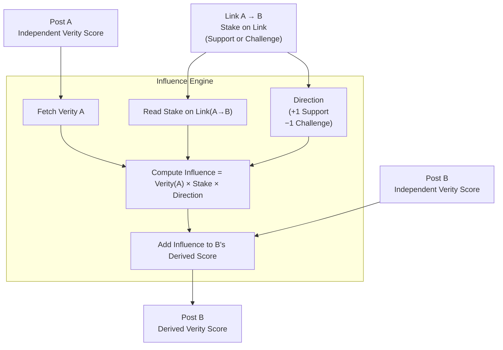

# VeriSphere Whitepaper  
**The Knowledge-Staking Protocol**  
**Version:** 12.1  
**Date:** October 29, 2025  
**Contact:** info@verisphere.co  
**Repository:** https://github.com/VeriSphereVSP

---

## 1. Abstract

VeriSphere is a decentralized knowledge-staking protocol that turns truth discovery into a competitive economic game. Users make claims, challenge claims, and **stake VSP tokens** to signal confidence — earning when they align with consensus and burning when they don’t. In short: it's the game of **put your money where your mouth is**.

Unlike content platforms that rely on moderators or opaque algorithms, VeriSphere is driven by open incentives and transparent math. Every assertion is a post on-chain; every agreement or challenge is backed by stake; and evidence can be linked between posts with contextual staking to strengthen or weaken claims. Accurate, well-supported ideas gain visibility and earn rewards. Weak or false claims lose stake and fade.

The fee to publish stays pegged to a fixed weight of gold, preserving stable participation costs as token value fluctuates. Unstaked tokens decay slowly to encourage active truth-seeking, not passive holding. Governance operates inside the same mechanism — meaning protocol upgrades, parameters, and bounties are decided by staking behavior, not foundation decree.

VeriSphere defines a new model for trust on the internet: a **market for truth** where information competes, consensus emerges economically, and users are rewarded for being right — not loudest.

---

## 2. Purpose & Motivation
Centralized knowledge systems lack aligned incentives:

- No cost to publish falsehood; limited rewards for accuracy.  
- Slow correction; static pages; editorial bottlenecks and bias.  
- Disconnected prediction markets; no durable, stake-weighted consensus.

**VeriSphere’s design principle:** make being wrong **costly** and being right **profitable**, so accuracy emerges from market pressure rather than editorial authority.

---

## 3. System Overview
A user creates a **claim** (a post). Others **stake** VSP to **support** or **challenge** it. Claims can be connected via **relations** (supports/conflicts) that also carry stake. From these primitives the protocol derives:

- **Base Verity Score (BaseVS):** stake-weighted confidence for a claim.  
- **Derived Verity Score (DerivedVS):** BaseVS plus stake-weighted influence from linked evidence.  
- **Visibility:** a ranking signal combining conviction and “skin in the game”.

Interfaces (including the reference site and any third-party app) read the same public state and formulas via open APIs/SDKs.

---

## 4. Tokenomics & Economics

### 4.1 VSP Token
- Utility: staking, fee burning, governance.  
- Supply: dynamic via **mint/burn** tied to staking outcomes.  
- Net issuance/deflation is emergent from market accuracy and participation.

### 4.2 Reward/Burn Dynamics
- **Aligned stake mints VSP**; **misaligned stake burns VSP**.  
- Incentives taper with post “depth”: early, under-staked claims earn higher marginal rewards; heavily staked claims earn near the floor.

**Launch parameters (governable):**
- **Max reward rate:** **10 ×** the U.S. **10-Year Treasury yield (10YUST)**.  
- **Min reward rate:** **1/10 × 10YUST**.  
- Interpolation: reward rates decrease from max → min as total stake depth increases.

**Unstaked balances decay:** VSP **held idle** (not staked) **burns at the minimum rate** to incentivize active participation and constrain passive inflation.

### 4.3 Fees Pegged to Gold (Not USD)
- **Posting fee** is **burned** in VSP at a value pegged to a **fixed weight of gold** (≈ **1/4000 oz** at launch).  
- Over time, the **VSP amount adjusts** so the fee’s **gold weight** stays constant—regardless of VSP/USD price.

**Engagement threshold:** The posting fee is **remembered** but **does not affect VS** until **external stake (support+challenge) ≥ posting fee**. Once this threshold is met, the remembered fee is activated as stake for VS calculations. Until then, **VS = 0**.

---

## 5. Verity Score & Relation Mechanics

### 5.1 Notation
- **A:** total VSP **support** stake on a claim  
- **D:** total VSP **challenge** stake on a claim  
- **T:** **A + D** (includes activated posting fee once threshold is met)

### 5.2 Base Verity Score
$$ \mathrm{BaseVS} = \left(2 \cdot \frac{A}{T} - 1\right)\times 100 \text{ (clamped to }[-100,+100]\text{)} $$

**Posting threshold rule:** VS remains **0** until **external stake ≥ posting fee**; then the fee is activated and included in \(A\) or \(D\) (depending on side) for VS.

### 5.3 Relations
- A **Relation** is a directed edge \(R: S \to A\) with type \(t \in \{+1\ \text{(support)}, -1\ \text{(challenge)}\}\).  
- Each relation has **contextual votes** (up/down) within the target \(A\)’s context and also exists as its **own standalone post** (the “link post”) with independent staking.  
- **No circular references**: attempts to create cycles are rejected at the protocol level.

### 5.4 Influence Components
- **Source normalization:** \( nVS(S) = \frac{\text{BaseVS}(S) + 100}{200} \in [0,1] \).  
- **Context polarity (A’s context):**  
  \[
  \text{Pol}(R \to A) = \frac{U_A - D_A}{U_A + D_A + \varepsilon} \in (-1, +1)
  \]
  where \(U_A, D_A\) are contextual up/down weights (in VSP or normalized units), \( \varepsilon > 0 \).  
- **Link credibility:** \( nVS(\text{LinkPost}_R) = \frac{\text{BaseVS}(\text{LinkPost}_R) + 100}{200} \).  
- **Size dampening:**  
  \[
  \text{Damp}(R) = \frac{1}{1 + \lambda \cdot \ln(1 + \text{LinkTotal}_R)} 
  \]
  with \(\lambda > 0\) governed, and \(\text{LinkTotal}_R\) = standalone link votes + sum of contextual votes network-wide.

### 5.5 Relation Contribution
\[
\text{Contrib}(R \to A) = t \cdot nVS(S) \cdot \text{Pol}(R \to A) \cdot nVS(\text{LinkPost}_R) \cdot \text{Damp}(R)
\]

### 5.6 Derived Verity & Visibility
\[
\text{DerivedVS}(A) = \text{clamp}\big(\text{BaseVS}(A) + \alpha \cdot \sum_{R:\ * \to A} \text{Contrib}(R \to A),\ -100,\ +100\big)
\]
with mixing factor \(\alpha \in (0,1)\), governed (default ≈ 0.2).

**Visibility (interface-oriented ranking):**
\[
\text{Visibility}(A) = \text{TotalStake}(A) \times \frac{\text{DerivedVS}(A) + 100}{200}
\]

### 5.7 Anti-Gaming Rules
- **No cycles**, enforced on-chain.  
- **Log dampening** caps single-relation dominance.  

---

## 6. Gameplay Flow
1. **Create claim** and **pay fee** (burned; VS remains 0).  
2. Community **stakes** to support or challenge; when **external stake ≥ fee**, fee activates into VS math.  
3. Users add **relations** (supports/challenges) and **vote** on links within contexts.  
4. **VS**, **DerivedVS**, and **Visibility** evolve with every event.  
5. **Aligned stakes earn** (rate tapers with depth); **misaligned stakes burn**; **idle balances decay** at the minimum rate.

Winning strategies: discover truth **early**, link **strong evidence**, **challenge** weak claims, and **stay engaged**.

---

## 7. Architecture & Modularity

### 7.1 Two Independent Layers
| Layer | Role | Notes |
|---|---|---|
| **VeriSphere Protocol** | On-chain primitives (posts, stakes, relations, oracle, governance, treasury) + open IDLs; off-chain indexer + deterministic derivations; public REST/GraphQL/WS + SDKs | **Ships first**; UI-independent; open to all clients |
| **VeriSphere Application Layer** | Reference website, wallet UX, AI-assisted search/synthesis, graph visualizations | Optional, replaceable; **no protocol privilege** |

### 7.2 On-Chain vs Off-Chain
| Item | On-Chain | Off-Chain |
|---|---|---|
| Post headers & content CIDs | ✅ | — |
| Stake ledgers, mint/burn events | ✅ | — |
| Relations & contextual link votes | ✅ | — |
| Gold-peg oracle values | ✅ | — |
| Governance objects, timelock, treasury | ✅ | — |
| Full text, media, embeddings | — | ✅ (IPFS/Arweave/search DB) |
| Deterministic DerivedVS/Visibility | — | ✅ (versioned formulas) |
| Public APIs/SDKs, caching, rate limits | — | ✅ |
| AI query/summarization | — | ✅ (UI layer only) |

---

## 8. AI-Assisted Knowledge Surfacing (UI Layer Only)
AI improves discovery and readability but **never** substitutes for economic consensus.

- Parse user intent; retrieve claims/relations.  
- Summarize the **staked** consensus with explicit stake metrics.  
- Suggest new claims or relations; user signs any on-chain action.  
- Cite sources; show VS/DerivedVS/Visibility transparently.

---

## 9. Governance (Run “Inside the Game”)

### 9.1 Proposals as On-Chain Posts
- Any change (params, upgrades, spends) is a **governance post** with an executable payload (e.g., “upgrade program X to ID Y”, “set \(\alpha = 0.25\)”, “pay N VSP to address A”).  
- Windows: start/end slot, quorum, thresholds are governed parameters.

### 9.2 Voting by Staking
- Stake **support/challenge** on the governance post, just like any claim.  
- Weighting methods (e.g., stake aging, minimum holding windows) are governed and transparent.

### 9.3 Timelock & Execution
- Passed proposals enter a **timelock** (e.g., 48–120h).  
- After timelock, the **governance executor** performs the encoded action.

### 9.4 Bounties, Approvals, Payments
- A **bounty** is a special governance object with **escrow**, scope, and acceptance criteria.  
- Contributors submit **deliverable posts** linked to the bounty; evaluators **stake** whether acceptance criteria are met.  
- Upon reaching thresholds, the **treasury pays** winners in VSP (mint or disburse).  
- Disputes spawn **counter-proposals**; all flows are **on-chain and auditable**.

---

## 10. Roadmap
| Phase | Deliverables |
|---|---|
| **Protocol Alpha** | Programs (posts, stakes, relations, oracle, governance, treasury); testnet; IDLs; SDKs; indexer |
| **Protocol Beta** | Mainnet; public APIs; reproducible `influence_v1` |
| **Ecosystem Launch** | Third-party clients; dashboards; analytics; grants/bounties |
| **Official Application** | Reference website, graph explorer, wallet UX, AI assistant |
| **Scale** | Parameter tuning via governance; multi-oracle resilience; additional language/tooling support |

---

## 11. Security & Integrity
- Wallet-signed writes; replay protection; program audits.  
- Oracle signer allow-list + optional medianization; upgradable via governance.  
- Anti-sybil & anomaly detection off-chain; transparent gates if adopted.  
- Deterministic, versioned derivations; reproducible from chain logs.  
- No protocol censorship; **Visibility** emerges from stake.

---

## 12. Conclusion
VeriSphere creates a **self-correcting, economically optimized truth market**. Claims compete on capital-backed conviction; relations propagate evidence across a living graph; governance itself runs through the same staking game. Fees are **gold-pegged** for durable, real-world cost stability; **idle balances decay** to encourage active truth-seeking.

The **Protocol ships first**—open, audited, and UI-agnostic—so anyone can build interfaces. In VeriSphere, **accuracy becomes profitable** and **misinformation becomes costly**.

---

## Appendix: Parameter Summary (Governable)
- Posting fee: fixed **gold weight** (~1/4000 oz at launch), VSP amount adjusts with oracle.  
- Reward rate bounds: **max = 10× 10YUST**, **min = 0.1× 10YUST**.  
- Idle burn: **unstaked balances burn at min rate**.  
- Influence parameter: threshold rule.  
- Governance windows: quorum, thresholds, timelock durations.  
- Oracle providers and averaging windows.

---

